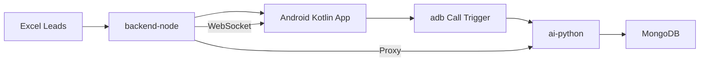

# AI Calling Automation System

**Production-grade AI-powered SIM calling automation platform**

---

## Overview

This project is an advanced AI-powered outbound calling automation system designed for:

- **Automated lead calling** — ADB-triggered SIM calls on real Android devices
- **AI-assisted conversations** — Faster-Whisper transcription + YES/NO intent detection
- **Campaign orchestration** — Excel lead import with sequential execution
- **Real-time device synchronization** — WebSocket-based Android ↔ backend live updates

The system integrates Android telephony automation, ADB call control, AI transcription, and campaign management into a unified architecture.

---

## Architecture



### Components

| Module | Stack | Responsibility |
|--------|-------|----------------|
| **backend-node** | Node.js + Express + WebSocket | Campaign orchestration, lead management, WebSocket server |
| **ai-python** | Python + FastAPI + Faster-Whisper | Speech-to-text, intent detection, recording analysis |
| **frontend-kotlin** | Android Kotlin | SIM calling automation, ADB-triggered calls, real-time sync |

---

## Core Features

### Android SIM Calling Automation
- Automatic outbound SIM calling via ADB
- Real Android device integration
- Live call state monitoring
- Call session tracking
- Automatic campaign execution

### AI Conversation Engine
- Faster-Whisper speech-to-text transcription
- AI intent detection (YES / NO classification)
- Conversation orchestration
- WAV-based greeting playback
- AI response workflows

### Campaign Management
- Excel lead import
- Sequential campaign execution
- Pending/completed lead tracking
- Retry handling
- Campaign status monitoring

### Real-Time Synchronization
- WebSocket-based Android ↔ backend connectivity
- Live device state updates
- Live call status events
- Heartbeat monitoring
- Auto reconnect logic

### Audio Processing
- WAV validation and telephony optimization
- FFmpeg preprocessing pipeline
- Audio diagnostics
- Recording handling

---

## Project Structure

```
.
├── backend-node/            # Node.js orchestration backend
│   ├── src/
│   │   ├── api/            # REST controllers
│   │   ├── routes/         # Express routes
│   │   ├── services/       # Business logic
│   │   ├── mongodb/        # Database models
│   │   ├── socket/         # WebSocket server
│   │   └── startup/        # Diagnostics & startup
│   ├── leads/              # Excel lead files
│   ├── recordings/         # Call recording storage
│   ├── logs/               # Backend logs
│   ├── audio/              # Audio optimization tools
│   └── package.json
│
├── ai-python/              # Python AI engine
│   ├── adb/                # ADB utilities
│   ├── transcription/      # Whisper logic
│   ├── workflow/           # Call orchestration
│   ├── workers/            # Background tasks
│   ├── recorder/           # Recording engine
│   ├── db/                 # MongoDB layer
│   ├── config.py           # Centralised settings
│   └── requirements.txt
│
├── frontend-kotlin/        # Android application
│   ├── src/main/
│   │   ├── java/com/optimatrix/gsmcall/
│   │   │   ├── telephony/        # Call state handling
│   │   │   ├── services/         # Foreground services
│   │   │   ├── audio/            # Playback & routing
│   │   │   ├── websocket/        # Real-time communication
│   │   │   ├── recording/        # Recording engine
│   │   │   ├── accessibility/    # Call UI automation
│   │   │   └── api/              # Backend communication
│   │   └── AndroidManifest.xml
│   └── build.gradle.kts
│
├── audio/                  # Shared audio assets
├── recordings/             # Recording storage
├── logs/                   # Centralised logs
├── leads/                  # Excel lead files
└── docker/                 # Docker configuration
```

---

## Technologies

| Layer | Technology |
|-------|------------|
| **Backend** | Node.js 18+, Express.js, WebSocket (ws), MongoDB/Mongoose |
| **AI Engine** | Python 3.10+, FastAPI, Faster-Whisper, NumPy, FFmpeg |
| **Android** | Kotlin, Android SDK 33+, TelephonyManager, AccessibilityService |
| **Database** | MongoDB 6.0+ |
| **Audio** | FFmpeg, AudioTrack, sounddevice, PyDub |

---

## System Requirements

### Backend Node.js
- Node.js ≥ 18.0.0
- MongoDB ≥ 6.0
- 4GB+ RAM recommended

### AI Python Engine
- Python ≥ 3.10
- PyTorch with CUDA support (optional, for GPU acceleration)
- FFmpeg installed and in PATH

### Android Device
- Android 13+ (API 33+) recommended
- USB debugging enabled
- Same WiFi network as backend
- Real device (emulator unsupported for telephony)

---

## Quick Start

### 1. MongoDB

```bash
# Install and start MongoDB (default: mongodb://localhost:27017)
# Or use MongoDB Atlas: https://www.mongodb.com/cloud/atlas
```

### 2. Backend Node.js

```bash
cd backend-node
cp .env.example .env
npm install
npm run dev
```

Server runs at: `http://localhost:3000`

### 3. AI Python Engine

```bash
cd ai-python
cp .env.example .env
python -m venv .venv
source .venv/bin/activate  # Windows: .venv\Scripts\activate
pip install -r requirements.txt
python main.py server
```

Server runs at: `http://localhost:8000`

### 4. Android Kotlin App

```bash
cd frontend-kotlin
./gradlew installDebug
```

### 5. Connect Android Device

Enable on device:
- **USB debugging**
- **Developer options**

Verify connection:
```bash
adb devices
```

### 6. Start Campaign

From Android app:
- Open the app
- Tap **"Start Automation"**

Or via API:
```bash
curl -X POST http://localhost:3000/api/adb/start \
  -H "Content-Type: application/json" \
  -d '{"campaignName":"My Campaign"}'
```

---

## Campaign Flow

```
Excel Lead
    ↓
backend-node imports lead
    ↓
Android receives campaign event
    ↓
adb initiates SIM call
    ↓
Call state tracked
    ↓
Greeting playback attempted
    ↓
Recording captured
    ↓
Whisper transcription
    ↓
Intent detection
    ↓
MongoDB persistence
```

---

## Audio System

### WAV Requirements

Required telephony format:
- **Mono**
- **8000 Hz sample rate**
- **PCM 16-bit**

### FFmpeg Optimization

```bash
ffmpeg -i greeting.wav \
  -ac 1 \
  -ar 8000 \
  -af "highpass=f=180, lowpass=f=3400, loudnorm, volume=12dB" \
  -c:a pcm_s16le \
  greeting_telephony.wav
```

---

## Backend APIs

### Health Check
```
GET /health
```

### Campaign APIs
```
POST /api/adb/start   # Start campaign
POST /api/adb/stop    # Stop campaign
GET  /api/adb/status  # Campaign status
```

### Lead APIs
```
GET    /api/leads                 # List leads
POST   /api/leads/import          # Import Excel
GET    /api/leads/stats           # Campaign statistics
```

### AI APIs
```
POST /api/transcribe      # Transcribe recording (legacy)
POST /api/call/execute    # Execute single ADB call
```

### WebSocket Events

**Android → Backend**
| Event | Description |
|-------|-------------|
| `android_ready` | Device ready |
| `heartbeat` | Keepalive |
| `call_state` | Call state update |
| `playback_started` | Playback started |
| `playback_completed` | Playback finished |

**Backend → Android**
| Event | Description |
|-------|-------------|
| `start_campaign` | Begin execution |
| `stop_campaign` | Stop automation |
| `play_greeting` | Trigger WAV playback |

---

## Android Permissions

Required permissions in `AndroidManifest.xml`:

```xml
<uses-permission android:name="android.permission.RECORD_AUDIO" />
<uses-permission android:name="android.permission.READ_PHONE_STATE" />
<uses-permission android:name="android.permission.CALL_PHONE" />
<uses-permission android:name="android.permission.FOREGROUND_SERVICE" />
<uses-permission android:name="android.permission.POST_NOTIFICATIONS" />
```

---

## Troubleshooting

### WebSocket Connection Failed

Check:
- `ping <backend-ip>` — ensure same WiFi network
- Backend reachable
- Firewall disabled

### Campaign Start Failed

Possible causes:
- No pending leads
- Backend offline
- ai-python offline
- WebSocket disconnected

### Android App Crashing

Check:
- Permissions granted
- Backend IP valid in `NetworkConfig.kt`
- ClearText traffic enabled
- Foreground service permissions

### WAV Not Audible To Remote Caller

**Important:** Android telephony restrictions prevent direct application-controlled GSM uplink injection on non-rooted devices.

Current implementation uses best-effort Android audio routing and playback strategies. Call recording capture works reliably, but live call audio injection is restricted by Android telephony security architecture.

---

## Logs

### Backend Logs
Location: `backend-node/logs/`

Includes:
- Campaign execution logs
- WebSocket events
- Call state changes

### Android Logs
Location: `recordings/android_logs/`

Includes:
- Service lifecycle logs
- Call flow logs
- Error traces

---

## Security Notes

- Never expose backend publicly without authentication
- Restrict WebSocket origins in production
- Validate uploaded recordings
- Secure MongoDB access
- Protect ngrok/public endpoints

---

## Future Roadmap

### Planned Improvements
- SIP/Asterisk integration
- Advanced AI conversations
- Multilingual TTS
- Dashboard analytics
- Campaign scheduling
- Live transcription UI
- Distributed Android device pool

### Research Directions
- Bluetooth HFP integration
- Rooted telecom experimentation
- Audio HAL routing research
- Advanced telephony pipelines

---

## License

Private Research / Experimental AI Telephony System

---

## Author

**Ritesh Gajjar**  
AI Calling Automation Research Project

---

## Disclaimer

This project is an experimental AI telephony automation platform intended for educational, research, and controlled automation scenarios.

Android telephony restrictions vary by:
- Device vendor
- Android version
- Carrier firmware
- Security policies

Behavior may differ across devices and environments.
